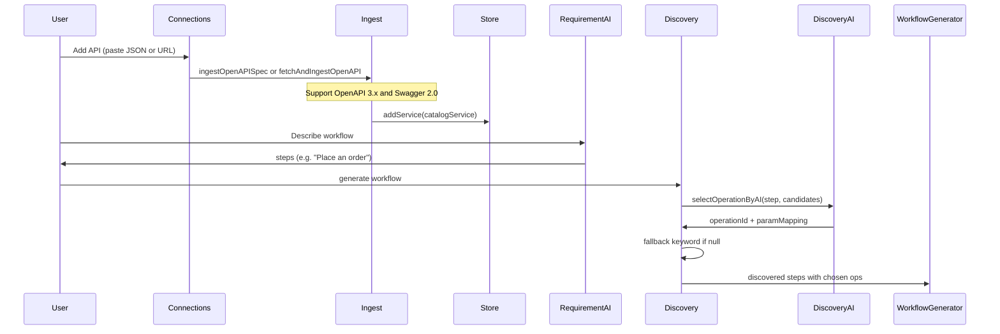

# AI-driven custom API integration

## Goal

When a user adds an OpenAPI JSON file or link (e.g. from FastAPI, Fastify, or a [Swagger 2.0 sample](https://raw.githubusercontent.com/OpenAPITools/openapi-generator/master/modules/openapi-generator-online/sample.json)), the **AI** should figure out which endpoint to use for each workflow step and why—not just keyword matching. Slack and Gmail integrations stay as-is; optional small improvements later.

---

## Current state

- [lib/openapi-ingest.ts](lib/openapi-ingest.ts): Parses **OpenAPI 3.x only** (uses `servers[0].url`; ignores Swagger 2.0’s `host`/`basePath`).
- [lib/api-discovery.ts](lib/api-discovery.ts): Maps each step to an operation via **keyword matching** (`findOperationByIntentInCatalog` on `intentKeywords`). Comment already says: "Later can be replaced with LLM semantic matching."
- User-added specs are merged into the catalog and appear in the HTTP node’s "Action" dropdown, but discovery does not use the model to pick the right operation for a step like "Place an order" or "Get pet by status."

---

## 1. Support Swagger 2.0 in ingest

Many frameworks expose specs that use **Swagger 2.0** (`swagger: "2.0"`, `host`, `basePath`, `paths` with `parameters` where `in: "body"` and `schema`).

**Approach:** In [lib/openapi-ingest.ts](lib/openapi-ingest.ts):

- **Detect spec version**: If `spec.swagger === "2.0"`, treat as Swagger 2.0; else treat as OpenAPI 3.x (existing logic).
- **Swagger 2.0 path**:
  - Base URL: `https://${spec.host}${spec.basePath || ""}` (or http if host has no scheme).
  - Iterate `spec.paths` the same way (path string → method keys get, post, put, patch, delete).
  - For each operation: `summary`/`operationId`/`description`; parameters from `op.parameters` (include `in: "body"` and resolve `schema.properties` for body params if needed).
  - Build the same `CatalogOperation` shape (id, name, description, method, urlTemplate, params, intentKeywords) so the rest of the app is unchanged.

**Deliverable:** One ingest function (or a small normalizer) that accepts either OpenAPI 3.x or Swagger 2.0 and returns `CatalogService`. Keep `fetchAndIngestOpenAPI` so "Load from URL" continues to work for both formats.

---

## 2. AI-based operation selection

**Idea:** For each workflow step that should map to an HTTP/custom API call, ask the LLM: "Given this step description and this list of available operations, which operation fits best (and optionally how to map parameters)?"

**New module** (e.g. [lib/api-discovery-ai.ts](lib/api-discovery-ai.ts)):

- **Input:**  
  - `stepDescription: string`  
  - `candidateOperations: CatalogOperation[]` (from merged catalog; can filter to "http" + OpenAPI-sourced only to limit tokens).
- **Output:**  
  - `{ operationId: string; paramMapping?: Record<string, string> } | null`  
  - Only allow `operationId` that exists in `candidateOperations` (validate response).
- **Prompt:**  
  - System: You are picking the best API operation for a workflow step. Given the step description and a list of operations (id, name, description, method, path), respond with ONLY a JSON object: `{"operationId": "<id>", "paramMapping": {"paramKey": "value or {{placeholder}}"}}`. Use operationId exactly as in the list. If no good match, respond `{"operationId": null}`.
  - User: Step: "". Operations: <compact list of id, name, description, method, path>.
- **Model:** Reuse the same resolution as [lib/requirement-ai.ts](lib/requirement-ai.ts) (e.g. `getModel()` from API key store) so no extra config.

**Integration in [lib/api-discovery.ts](lib/api-discovery.ts):**

- For each step:
  - If the step is HTTP-like (e.g. `suggestedService === "http"` or we want to try API for any step that didn’t match email/Slack):  
    - Build candidate list (e.g. all operations from services that are "http" or from OpenAPI store).  
    - If there are candidates and an API key is available, call the new AI selection function.  
    - If it returns a valid operationId, use that operation and its paramMapping.
  - Else, or if AI returns null / no key: **fall back** to current `findOperationByIntentInCatalog` (keyword matching).

**Deliverable:** Discovery uses the AI to pick the right endpoint when the user has added a spec and an API key is set; otherwise behavior unchanged (keyword + "Custom HTTP" fallback).

---

## 3. (Optional) Make requirement AI aware of added APIs

So the **step descriptions** themselves align with the user’s APIs (e.g. "Place an order" when the user added Petstore).

**Approach:** Before calling the requirement model in [lib/requirement-ai.ts](lib/requirement-ai.ts):

- Read OpenAPI-sourced services from the store (e.g. `useOpenApiStore.getState().getServices()`).
- If non-empty, append to the system prompt a short line: "Available custom APIs: [ServiceName: op1, op2, ...]. Prefer these for steps that match (e.g. 'place order' -> Place order)."
- No change to the response schema; the existing steps + suggestedService stay. Discovery (with AI selection) will then map those steps to the right operation.

**Deliverable:** Optional; can be a follow-up. Improves end-to-end flow when the user has added a spec.

---

## 4. Slack / Gmail

Keep as-is for this work. "Do more things with those then better" can be a later iteration (e.g. more operations, better labels, or more intent keywords).

---

## Flow (high level)

---

## Implementation order

1. **Swagger 2.0 in openapi-ingest** — Normalize 2.0 to the same catalog shape; ensure URL and "Import JSON" both work for 2.0 and 3.x.
2. **api-discovery-ai** — New module with `selectOperationByAI(stepDescription, candidateOperations)` using existing model/key; strict JSON output and validation of operationId.
3. **Wire discovery to AI** — In api-discovery, for HTTP-like steps with OpenAPI candidates, call AI selection and fall back to keyword matching.
4. **(Optional)** **Requirement AI prompt** — Append available custom API names and operation names to the system prompt when the OpenAPI store has services.

---

## Files to touch

| Area      | File                                           | Change                                                                                                                                            |
| --------- | ---------------------------------------------- | ------------------------------------------------------------------------------------------------------------------------------------------------- |
| Ingest    | [lib/openapi-ingest.ts](lib/openapi-ingest.ts) | Add Swagger 2.0 branch: host+basePath, same path/method loop, body from parameters with `in: "body"` and schema.                                  |
| New       | `lib/api-discovery-ai.ts`                      | `selectOperationByAI(stepDescription, operations)`; use getModel(); prompt + parse JSON; return operationId + paramMapping or null.               |
| Discovery | [lib/api-discovery.ts](lib/api-discovery.ts)   | For each step, build HTTP/OpenAPI candidates; if any and model available, call selectOperationByAI; else keyword. Use chosen op and paramMapping. |
| Optional  | [lib/requirement-ai.ts](lib/requirement-ai.ts) | If OpenAPI store has services, append "Available custom APIs: ..." to system prompt.                                                              |

No change to the HTTP node UI or workflow generator beyond what discovery already provides (operationId and paramMapping); they already consume discovered steps.